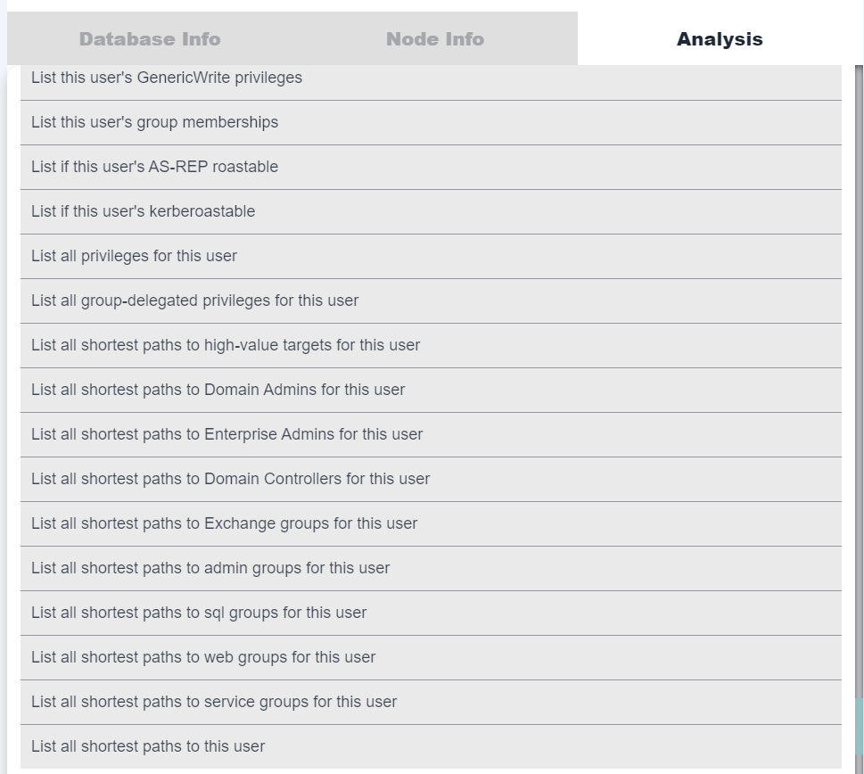

# cypherhound

A `Python3` terminal application that contains 405 `Neo4j` cyphers for BloodHound data sets and a `customqueries.json` file containing 388 cyphers for the GUI.

## Why?

`BloodHound` is a staple tool for every red teamer. However, there are some negative side effects based on its design. I will cover the biggest pain points I've experienced and what this tool aims to address:

1. My tools think in lists - until my tools parse exported `JSON` graphs, I need graph results in a line-by-line format `.txt` file
2. Copy/pasting graph results - this plays into the first but do we need to explain this one?
3. Graphs can be too large to draw - the information contained in any graph can aid our goals as the attacker and we *need* to be able to view *all* data efficiently
4. Manually running custom cyphers is time-consuming - let's automate it :)

This tool can also help blue teams to reveal detailed information about their Active Directory environments as well. Matter-of-fact, there are enough cyphers packaged within this project to allow complete visibility into an Active Directory environment. The nature of the cyphers allow the operator to enumerate the environment with scalpel precision, mapping virtually every and any attack path/privilege possible.

## Features

Take back control of your `BloodHound` data with `cypherhound`!

- 405 cyphers as of date
  - Set cyphers to search based on user input (user, group, and computer-specific)
  - User-defined regex cyphers
- User-defined exporting of all results
  - Default export will be just end object to be used as target list with tools
  - Raw export option available in `grep/cut/awk`-friendly format
- `customqueries.json` file included
  - Run the same queries from the GUI

## Installation

Make sure to have `python3` installed and run:

`python3 -m pip install -r requirements.txt`

## Usage

Start the program with: `python3 cypherhound.py -c config.json`

## config.json

The program will read a configuration file in `json` format. An example of this file is shown below:

```json
{
    "user": "neo4j",
    "pwd": "password",
    "database": "neo4j"
}
```

where:
- `user` is your `Neo4j` username
- `pwd` is your `Neo4j` password
- `database` is your `Neo4j` database

## Commands

The full command menu is shown below:

```
Command Menu
set - used to set search parameters for cyphers, double/single quotes not required for any sub-commands
    sub-commands
        user - the user to use in user-specific cyphers (MUST include @domain.name)
        group - the group to use in group-specific cyphers (MUST include @domain.name)
        computer - the computer to use in computer-specific cyphers (SHOULD include .domain.name or @domain.name)
        regex - the regex to use in regex-specific cyphers
    example
        set user svc-test@domain.local
        set group domain admins@domain.local
        set computer dc01.domain.local
        set regex .*((?i)web).*
run - used to run cyphers
    parameters
        cypher number - the number of the cypher to run
    example
        run 7
export - used to export cypher results to txt files
    parameters
        cypher number - the number of the cypher to run and then export
        output filename - the number of the output file, extension not needed
    example
        export 31 results
list - used to show a list of cyphers
    parameters
        list type - the type of cyphers to list (general, user, group, computer, regex, all)
    example
        list general
        list user
        list group
        list computer
        list regex
        list all
search - used to search the list of cyphers
    parameters
        search query - the search string
    example
        search domain admin
        search shortest
q, quit, exit, stop - used to exit the program
clear, cls - used to clear the terminal
help, ? - used to display this help menu
```

## customqueries.json

Almost all cyphers included in the terminal application (388 to be exact) have been ported over to `json` format for direct usage in the GUI. Follow the instructions below in order to begin using them!



### Linux

Copy the `customqueries.json` file to `~/.config/bloodhound/`

### Windows

Copy the `customqueries.json` file to `C:\Users\<YourUsername>\AppData\Roaming\bloodhound\`

## parse-memberships.py

This script will parse a raw export from the terminal application, specifically the cypher to list all user group memberships as an example for how this tool's output can be parsed. You will pass this export as a parameter to the script, a `NTDS.dit` file, and an output directory. It will then produce `.txt` files in the output directory for every group name with entries in `DOMAIN\USER` format, compatible with [DPAT](https://github.com/clr2of8/DPAT). It will then also produce the `-g` commandline argument to pass to [DPAT](https://github.com/clr2of8/DPAT), allowing the operator to produce group-specific statistics for every group in a domain.

### Usage

To use the script, you should have two files ready:

1. The raw export from the terminal application that retrieves all user group memberships
2. A `NTDS.dit` file with lines in the following format: `domain\user:RID:LMhash:NTLMhash:::`

The script can be run with the following command:

```bash
python parse-memberships.py <memberships_filename> <domain> <ntds_filename> <output_directory>
```

where:
- `parse-memberships.py` is the name of the script file.
- `<memberships_filename>` is the file containing the group membership data, exported from terminal application.
- `<domain>` is the domain name to be used for parsing the memberships file.
- `<ntds_filename>` is the `ntds.dit` file containing user data.
- `<output_directory>` is the directory where the script will output the group files.

## add-owned.py

This script will read a list of node names from a `.txt` file and mark them as either owned or high-value in the database.

### Usage

To use the script, you should have two files ready:

- A line by line `.txt` file containing node names in the `BloodHound` format
  - For users: `USER@DOMAIN.LOCAL`
  - For groups: `GROUP@DOMAIN.LOCAL`
  - For computers: `COMPUTER.DOMAIN.LOCAL`
- Your configuration file in `json` format containing your `Neo4j` username, password, and database (example shown above)

The script has the following options:

```
  -h, --help            show this help message and exit
  -c CONFIG, --config CONFIG
                        Config file
  -l LIST, --list LIST  List of node names
  -o, --owned           Set target nodes as owned
  -v, --high-value      Set target nodes as high-value
```

You need to specify at least `-o` or `-v`

## Important Notes

- The program is configured to use the default `Neo4j` database and `URI`
- Built for `BloodHound 4.3.1`, certain edges will not work for previous versions
- `Windows` users must run `pip3 install pyreadline3`

## A Word About Sponsorship

On `July 15, 2023` I decided to make some changes to the project. After this date, this project will always be kept one version behind the private version for sponsors. Be sure to sponsor me for access to the latest cyphers, features, and bug fixes. By sponsoring me in this tier, you will also get access to additional private repositories I've not released to the public!

## Future Goals

- Add cyphers for `Azure` edges
- Continue to add cyphers when BloodHound releases updates
- Continue to add cyphers

## Issues and Support

Please be descriptive with any issues you decide to open and if possible provide output (if applicable).
